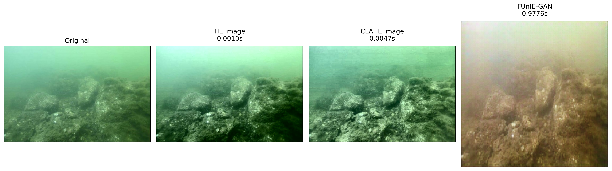
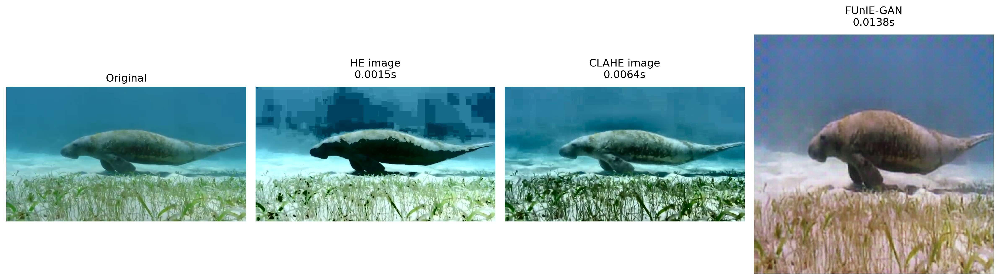
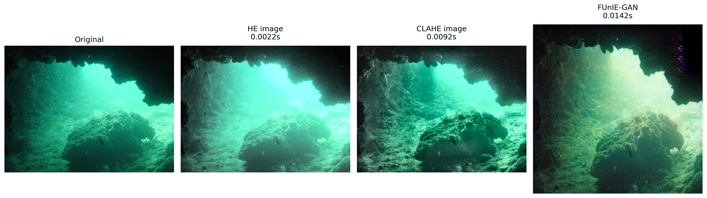

# Underwater Image Enhancement: Traditional vs Deep Learning

Underwater visual information play a crucial role in perceiving and gathering data about the environment. It is easy for underwater vehicles to obtain images but due to various complexities of the aquatic terrains along with light absorption behavior and scattering in water the original images turn out to be degraded in quality consequently making them unfit for analysis and interpretation by the human eye and computers.

For this reason various image processing algorithms are used in conjunction with one another or in a standalone way to enhance the quality of the raw image captured in an efficient manner. The problems of color bias, low contrast, fuzziness are effectively mitigated by using various traditional techniques and more recently deep learning based image enhancement strategies. The methods based on deep learning can be divided into those based on convolution neural networks (CNN) and those based on generative adversarial networks (GAN) such as FUnIE-GAN, Water-Net, UWCNN. On the other hand traditional image processing algorithms used for underwater image enhancements such as Histogram Equalization (HE), Contrast Limited Adaptive Histogram Equalization (CLAHE), White Balance (Gray World Assumption) etc.

### General Consensus

**Traditional Methods:**

Pros: 
- Lightweight and Fast
- Deterministic
  
Cons:
- Not adaptable, limited by initial rules
- No real understanding of the image

**Deep learning based methods:**

Pros:
- Learns directly from data
- Can handle complex degradation
  
Cons: 
- Higher compute overhead than traditional
- Non-deterministic performance. Relies on domain match and can hallucinate

We want to see the differences in perceptual quality and inference/computation
speed between traditional approaches and deep learning models.

For the current task at hand I have chosen HE, CLAHE as traditional techniques. Several deep learning models exist for underwater enhancement but I have chosen FUnIE-GAN running on T4 GPU as its specifically trained for AUV based technology due to being lightweight through which we will enhance the images. I have chosen 10 images from the UIEB dataset which are portraying different types of possible underwater images to test out the metrics mentioned above.

**Histogram Equalization (HE):** globally redistributes pixel intensities across the full range.

**Contrast Limited Adaptive Histogram Equalization (CLAHE):** a smarter way to do HE where the image is divided into tiles resulting in a more localized contrast enhancement.

**FUnIE-GAN:** a GAN based deep learning model trained specifically on underwater images to restore color balance and reduce haze. Designed to be lightweight enough for real time use on AUV embedded hardware.

Let's look at some results about differences in perceptual quality first,

This original image suffers from green color cast and haze. From the image perceptually it is clear that CLAHE has the best quality out of all of them. It clears out a lot of fuzziness from the image and perfectly balances the contrast. On the other hand HE suffers from loss of detail in some regions notably the darker regions where the image loses a lot of edges and crispness along with notable color distortion. FUnIE-GAN overcorrected the greenish cast to make it yellowish which is signficant color distortion. Along with that FUnIE-GAN due to being restricted to only use images of size 256x256 loses a lot of fine details due to pixel distortion.

This image clearly demonstrates one of the most common drawback of HE. Which is aggressively redistributing the historgram globally resulting in this pixelated image. Some regions are very dark which loses much more detail than acceptable. CLAHE although much better than the HE image it still has slight pixelations at some regions but the overall balanced contrast improves the ability to see fine grained details significantly. FUnIE-GAN on the other hand introduces various RGB artifacts in the entire image trying to restore the color balance.

This image on the otherhand clearly showcases how balanced contrast can significantly improve the perceptual ability to see details and tell depth apart in the CLAHE image. HE suffers from global brightness increase resulting in over bright regions which loses details similar to the previous image but on the opposite end of the spectrum where instead of making regions darker it makes regions much lighter than required which results in lack of depth recognition as well. This image also showcases the artifact hallucination issue FUnIE-GAN has where at the top right we can see a patch of random colors introduced into the image.

For the rest of the images as well CLAHE consistenly gave out images with proper balanced contrast and improved perceptual ability to differentiate details and depth. Whereas HE due to not having spatial awareness failed to preserve the color in many cases as well as losing details by overly amplifying noise. FUnIE-GAN despite being a model trained specificially on underwater images performed worse and nondeterministically likely due to factors such as 256x256 size limit and hallucinations causing low contrast, blurriness, artifact generation.

As for Inference/Computation Speed the following table shows the average time required to generate the enhanced image,

| Method    | Average Inference Time | Max Time  | Min Time |
|-----------|------------------------|-----------|----------|
| HE        |    2.27 ms             |  6.9 ms   |  0.8 ms  |
| CLAHE     |    9.61 ms             |  27.8 ms  |  2.8 ms  |
| FUnIE-GAN |    110.95 ms           |  977.6 ms |  11.6 ms |

HE is the fastest by far due to simple operation. CLAHE is slightly slower due to processing tiles first. FUnIE-GAN is significantly slower than both due to using GPU operation the max of 977.6 ms is likely due to GPU warmup but it's minimum time is also the greatest. It is worth noting here that despite running FUnIE-GAN on a T4 GPU it was about 11.5x slower than CLAHE on average.

# Conclusion

Traditional preprocessing techniques based on the results of this test seem to be favorable for underwater images. CLAHE has performed better in terms of inference speed and perceptual quality. Along with keeping messy real world images and data in mind especially for things like AUVs traditional methods seem more reliable than deep learning models.

It should be kept in mind that multiple preprocessing techniques could be used together to enhance the image quality even more such as along with improving contrast with CLAHE also adding White Balance to restore natural colors.
As well as the fact that DL techniques can be made better with a more sophisticated preprocessing pipeline to fully accommodate the model entirely. In general DL models have an extra overhead of requiring extra compute along with non-deterministic behavior depending on training data and other parameters while traditional methods do not depend on training data and are deterministic algorithms.

